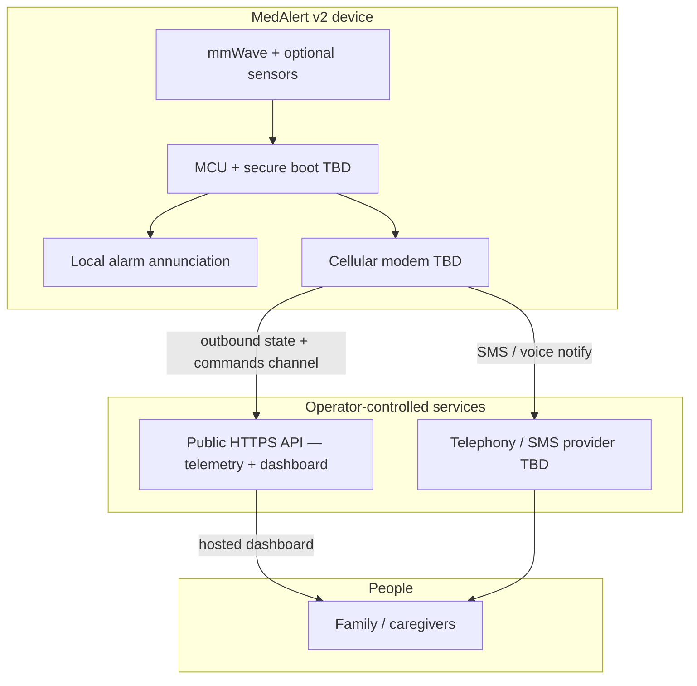

# MedAlert v2 — roadmap (draft)

This document captures a **product and regulatory direction** for a future **v2** program. It is **engineering and planning notes only** — not legal advice, not a regulatory strategy, and not a commitment of features until reviewed with **FDA/regulatory counsel** and any **OEM / distribution partners** as applicable.

**Relationship to v1 (this repository):** The current firmware is a **demonstration prototype**—meant to **show investors and partners** a credible slice of the product (Wi‑Fi, captive portal, staged SMS, LAN dashboard, local alarm) to **support fundraising** and a path to market. It is **not** itself the certified commercial device. **v2** is expected to be a **separate, QMS‑governed development effort** that may reuse concepts (mmWave, alarm FSM, UX patterns) but not the same evidence base or risk file. A possible **v3** (cleared device + device‑originated **E911**) is **out of scope** for v2 planning here — see **§10** as a non‑binding placeholder only.

---

## 1. Problem statement (draft)

Families need **reliable early awareness** when a loved one’s condition may have worsened, and a **defined escalation path** when local caregivers do not respond — so that alerts are not limited to “hope someone reads a text.” The v1 device improves **local signaling** and **best‑effort remote notification**; v2 targets **higher assurance**, **connectivity independence**, and **repeatable escalation to configured contacts** (e.g. family, caregivers) — **without** a contracted third‑party **monitoring center**.

---

## 2. Intended use (draft — for counsel to rewrite)

> **Placeholder.** Replace with lawyer‑ and regulator‑approved language.

- **User population:** [e.g. adults under clinical care at home — TBD with physicians.]
- **Environment:** [e.g. bedside / fixed install — TBD.]
- **Function:** Non‑invasive estimation of [vitals / presence — exact claims TBD]; generation of **alarms** when criteria are met; **local** annunciation; **remote** notification and **escalation** per configured policy to **named contacts** (SMS/voice/API‑mediated dashboard — TBD); **no** UL / central‑station **monitoring center** in this roadmap.
- **911 / EMS (product intent):** The system **does not** place emergency calls or dispatch EMS. **Users and caregivers decide** whether to call **911** (or other emergency services). The product’s role is to surface **timely alerts** and **patient / situational information** (e.g. medical template text, vitals snapshot, location context as designed) so that **people** can act — including making an informed call if they judge it necessary. **IFU and labeling** must not imply automatic PSAP dispatch (counsel).
- **Explicit non‑goals until proven:** Any claim equivalent to **diagnosis**, **treatment**, or **guaranteed** detection of a specific medical event must be avoided unless supported by **clinical evidence** and **cleared indications**.

**Open:** Wellness vs. medical device classification (FDA and other jurisdictions); predicate strategy if Class II 510(k) (U.S.).

---

## 3. v2 capability targets (high level)

| Area | v1 (prototype) | v2 (direction) |
|------|----------------|----------------|
| Connectivity | Home Wi‑Fi | **Cellular** primary or backup; resilient failover policy |
| Remote notify | Twilio SMS (2 numbers) | SMS and/or **voice**; **multiple contacts**; retry / backoff policies under design control |
| Emergency / EMS | Not designed for PSAP | **No automated 911 or EMS dispatch.** Notified users/caregivers **choose** whether to call **911**; product provides **patient/situational info** (SMS, voice message content, dashboard/API — TBD) to support that **human decision**. **IFU** must state limits clearly (counsel); not “SMS‑to‑911” as a product‑guaranteed path |
| Escalation | Fixed timers | **Policy engine**: local → family / contacts → **acknowledgment** (where designed) → documented outcomes in app/API logs |
| Remote dashboard | LAN IP only (`http://<device>/`) | **Public HTTPS API** + device **outbound sync**; hosted UI calls your API **from anywhere** (see §4.1) |
| Power | As built | **Battery backup**, power‑fail behavior, explicit low‑battery alarm |
| Quality | Informal | **QMS**, **ISO 14971** risk, **IEC 62304** software, **IEC 60601‑1** (and applicable collaterals), **cybersecurity** program |
| Labeling | README warnings | **IFU**, contraindications, alarm limits, connectivity failure behavior |

---

## 4. Architecture (conceptual)

**Notes:**

- **No monitoring center** in this architecture: escalation is **device → cloud (your API) + carrier voice/SMS → configured people**. **911 / EMS:** the device and cloud **do not** initiate emergency services. **Caregivers decide** to call 911 and use the **information the product already showed them** (alerts, medical template, vitals context, etc.) when speaking with dispatch — a **human** judgment, not an automated system output to PSAP.
- **911 / EMS** claims and any “assist emergency call” language belong in **IFU and counsel‑reviewed** labeling — the roadmap assumption is **information‑only support**, not dispatch.

### 4.1 Remote dashboard — public API + device outbound (v2 intent)

**Goal:** Caregivers open a **hosted dashboard from anywhere** (browser on cellular or another network) without exposing the bedside device as a **direct inbound** target on home Wi‑Fi.

**Direction (engineering):**

| Piece | Role |
|--------|------|
| **Public HTTPS API** (your server) | Authenticates devices and users; stores **latest telemetry / alarm state** (or short history per policy); exposes **read** for dashboard and **write** for commands (e.g. cancel / acknowledge). |
| **v2 device** | Uses **outbound-only** connectivity (cellular and/or Wi‑Fi): periodically **POST** state to the API; **GET** (or subscribe via WSS/MQTT later) for **pending commands** and applies them locally (same semantics as today’s LAN cancel). |
| **Dashboard static site** | Served from your public web host; **only** calls `https://api…` — never the device’s private LAN IP. |

**First implementation bias:** **HTTPS + short polling** for telemetry and command pickup (simple to validate and to operate under design control); **WebSocket/MQTT** can be a later optimization for latency.

**Non‑negotiables for productization:** TLS; **per‑device** (and optionally per‑user) **authentication**; **rate limits**; minimal retention of health‑adjacent data; **audit** of config and cancel actions; explicit behavior when the API or network is unavailable (align with alarm FSM and IFU). **Emergency use:** UI/copy must **not** imply the service dials 911 or dispatches EMS; present **facts + configured medical text** so caregivers can decide.

**Relationship to v1:** v1’s LAN `WebServer` dashboard remains a reasonable **local technician / demo** path; v2 adds a **cloud‑mediated** path for remote caregivers without port‑forwarding the device.

---

## 5. Hardware direction (TBD in design inputs)

- **Cellular:** LTE‑M / NB‑IoT and/or voice‑capable module — chosen against **antenna**, **certification** (carrier PTCRB / carrier approval), **power**, and **audio** requirements.
- **Battery:** chemistry, charge circuit, **runtime** targets, **thermal** limits.
- **Enclosure / mounting:** ingress, cleaning, cable strain relief.
- **Optional:** two‑way audio, **fall** or **button** channel, **BLE** for setup only (security implications).

---

## 6. Software / systems direction

- **Alarm FSM:** explicit states for connectivity loss, **cloud/API** unreachable, retry budgets, and **safe degradation** (e.g. local alarm only with clear indication).
- **Security:** TLS trust model, **signed updates**, **key storage**, **logging** and **privacy** (HIPAA may apply depending on data handled — **counsel**).
- **Configuration:** provisioning that survives **audit** (who changed what, when).
- **Separation:** consider isolating **certified** alarm path from **non‑certified** convenience features (dashboard, analytics) if that simplifies validation.
- **Cloud API (dashboard path):** threat model for **API keys**, token rotation, abuse, and **command spoofing** (cancel / ack must bind to the right device and authorized principal); logging and retention policy aligned with privacy counsel.

---

## 7. Regulatory and quality (checklist for professionals)

Engage specialists early. Typical workstreams (jurisdiction‑dependent):

- **Classification** and **submission** pathway (e.g. U.S. FDA 510(k), De Novo, or other).
- **Quality system:** 21 CFR Part 820 (U.S.) / **ISO 13485**.
- **Risk management:** **ISO 14971**.
- **Software lifecycle:** **IEC 62304** (class of software safety to be determined).
- **Electrical safety / EMC:** **IEC 60601‑1** series as applicable.
- **Usability:** **IEC 62366**.
- **Clinical / performance evaluation** aligned with **indications** (not started in this doc).
- **Post‑market:** surveillance, complaint handling, **recall** plan.

---

## 8. Open questions (for regulatory counsel & partners)

1. **Indications for use:** Exact wording and **patient population** — drives classification and clinical evidence.
2. **Primary escalation:** Contact order, **ACK** requirements and timeouts, and what happens when **no one** acknowledges (local alarm persistence only vs. additional channels — all **without** a monitoring center).
3. **911 / EMS:** Product intent is **user‑/caregiver‑initiated** calls only, with **patient info** supplied by the product for context. Counsel must review **misuse** (delayed call, over‑reliance on vitals), **copy** on SMS/dashboard, and **regional** rules about what may be communicated.
4. **Data:** What leaves the device (PHI, PHI‑adjacent); **HIPAA**, **state privacy**, **GDPR** if EU.
5. **Human factors:** Install by lay user vs. technician; **false alarm** burden and mitigation.
6. **v1 codebase reuse:** What can be carried forward under **change control** vs. rewritten with **requirements traceability**.

---

## 9. Suggested next steps (before heavy engineering)

1. **Written intended use** — one page — reviewed by **regulatory counsel**.
2. **Carrier / module OEM conversations:** cellular **certification**, **SLAs**, and voice/SMS capabilities for your escalation design (no central‑station listing path assumed here).
3. **Risk workshop:** top hazards (missed alarm, false alarm, privacy breach, battery death, cellular gap, API outage).
4. **Freeze v1** as **non‑medical prototype**; branch or new repo for **v2 DHF** when QMS exists.

---

## 10. v3 (aspirational — placeholder)

**Not in scope for v2 in this document.** v3 is a **placeholder** for a later program that would pursue **cleared / approved medical device** status (jurisdiction‑specific: e.g. U.S. **FDA** pathway TBD, **ISO 13485** QMS, **IEC 60601‑1**, **IEC 62304**, **ISO 14971**, clinical/performance evidence per **indications for use**) and would add **regulated emergency calling** — **E911 / NG911** or equivalent **from the product** — with **location**, **callback identity**, and **PSAP routing** as required by **regulators** and **the chosen telephony path** in each market. **Implementation options** are not fixed: **native cellular voice** (e.g. VoLTE) and **CPaaS programmable voice** (e.g. **Twilio** supports **E911** with **registered emergency addresses** and related Voice APIs) are both **architecture decisions** to compare under counsel and carrier rules — not selected here.

**Contrast:** v2 assumes **no** automated PSAP dispatch and **user‑/caregiver‑initiated** 911 (§2–§4). **v3** would explicitly **change** that model only after **design control**, **risk management**, and **counsel‑approved** labeling — not by extending the v1 prototype firmware in place.

**Open (for v3 planning only):** Native **vs** CPaaS E911 (static **registered location** vs **dynamic** / nomadic use), **ALI** / location accuracy, **SRVCC**, carrier or **Twilio** certification and **SLA**, false‑alarm liability, and **regional** PSAP rules. This section is **not** legal or regulatory advice.

---

## 11. Document control

| Field | Value |
|-------|--------|
| Status | Draft |
| Owner | Project maintainer |
| Reviewers | Regulatory counsel (TBD), clinical advisor (TBD) |

*Last updated: 2026-05-31 — §4.1 remote dashboard; no monitoring center; v2: user‑initiated 911 + patient info (§2–§4); §10 v3: certified device + E911 (native cellular or CPaaS e.g. Twilio); revise after professional review.*
