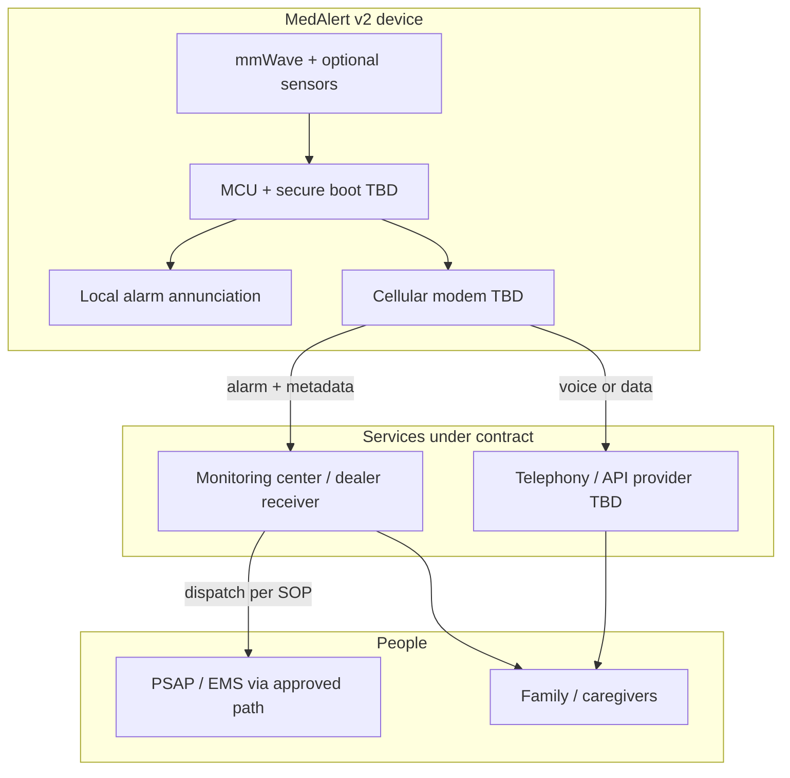

# MedAlert v2 — roadmap (draft)

This document captures a **product and regulatory direction** for a future **v2** program. It is **engineering and planning notes only** — not legal advice, not a regulatory strategy, and not a commitment of features until reviewed with **FDA/regulatory counsel** and any **monitoring / OEM partners**.

**Relationship to v1 (this repository):** The current firmware is a **demonstration prototype**—meant to **show investors and partners** a credible slice of the product (Wi‑Fi, captive portal, staged SMS, LAN dashboard, local alarm) to **support fundraising** and a path to market. It is **not** itself the certified commercial device. **v2** is expected to be a **separate, QMS‑governed development effort** that may reuse concepts (mmWave, alarm FSM, UX patterns) but not the same evidence base or risk file.

---

## 1. Problem statement (draft)

Families need **reliable early awareness** when a loved one’s condition may have worsened, and a **defined escalation path** when local caregivers do not respond — so that alerts are not limited to “hope someone reads a text.” The v1 device improves **local signaling** and **best‑effort remote notification**; v2 targets **higher assurance**, **connectivity independence**, and **professional escalation** where appropriate.

---

## 2. Intended use (draft — for counsel to rewrite)

> **Placeholder.** Replace with lawyer‑ and regulator‑approved language.

- **User population:** [e.g. adults under clinical care at home — TBD with physicians.]
- **Environment:** [e.g. bedside / fixed install — TBD.]
- **Function:** Non‑invasive estimation of [vitals / presence — exact claims TBD]; generation of **alarms** when criteria are met; **local** annunciation; **remote** notification and **escalation** per configured policy, including optional **monitored** response.
- **Explicit non‑goals until proven:** Any claim equivalent to **diagnosis**, **treatment**, or **guaranteed** detection of a specific medical event must be avoided unless supported by **clinical evidence** and **cleared indications**.

**Open:** Wellness vs. medical device classification (FDA and other jurisdictions); predicate strategy if Class II 510(k) (U.S.).

---

## 3. v2 capability targets (high level)

| Area | v1 (prototype) | v2 (direction) |
|------|----------------|----------------|
| Connectivity | Home Wi‑Fi | **Cellular** primary or backup; resilient failover policy |
| Remote notify | Twilio SMS (2 numbers) | SMS and/or **voice**; **multiple contacts**; retry / backoff policies under design control |
| Emergency / EMS | Not designed for PSAP | **Voice path** and/or **monitoring center → dispatch** per contracted model — **not** “SMS to 911” as the sole strategy |
| Escalation | Fixed timers | **Policy engine**: local → family → **acknowledgment** → **monitoring** → documented outcomes |
| Power | As built | **Battery backup**, power‑fail behavior, explicit low‑battery alarm |
| Quality | Informal | **QMS**, **ISO 14971** risk, **IEC 62304** software, **IEC 60601‑1** (and applicable collaterals), **cybersecurity** program |
| Labeling | README warnings | **IFU**, contraindications, alarm limits, connectivity failure behavior |

---

## 4. Architecture (conceptual)

**Notes:**

- **Monitoring center** is typically a **contracted** service with **listed** equipment paths (formats, redundancy, operator training). Integration is a **business + technical** deliverable, not only firmware.
- **911 / EMS** in production is usually reached through **voice** and/or **the center**, with **addresses and callbacks** defined in the system design — details are **regional** and **product‑specific**.

---

## 5. Hardware direction (TBD in design inputs)

- **Cellular:** LTE‑M / NB‑IoT and/or voice‑capable module — chosen against **antenna**, **certification** (carrier PTCRB / carrier approval), **power**, and **audio** requirements.
- **Battery:** chemistry, charge circuit, **runtime** targets, **thermal** limits.
- **Enclosure / mounting:** ingress, cleaning, cable strain relief.
- **Optional:** two‑way audio, **fall** or **button** channel, **BLE** for setup only (security implications).

---

## 6. Software / systems direction

- **Alarm FSM:** explicit states for connectivity loss, center handshake failure, retry budgets, and **safe degradation** (e.g. local alarm only with clear indication).
- **Security:** TLS trust model, **signed updates**, **key storage**, **logging** and **privacy** (HIPAA may apply depending on data handled — **counsel**).
- **Configuration:** provisioning that survives **audit** (who changed what, when).
- **Separation:** consider isolating **certified** alarm path from **non‑certified** convenience features (dashboard, analytics) if that simplifies validation.

---

## 7. Regulatory and quality (checklist for professionals)

Engage specialists early. Typical workstreams (jurisdiction‑dependent):

- **Classification** and **submission** pathway (e.g. U.S. FDA 510(k), De Novo, or other).
- **Quality system:** 21 CFR Part 820 (U.S.) / **ISO 13485**.
- **Risk management:** **ISO 14971**.
- **Software lifecycle:** **IEC 62304** (class of software safety to be determined).
- **Electrical safety / EMC:** **IEC 60601‑1** series as applicable.
- **Usability:** **IEC 62366**.
- **Clinical / performance evaluation** aligned with **indications** (not started in this doc).
- **Post‑market:** surveillance, complaint handling, **recall** plan.

---

## 8. Open questions (for regulatory counsel & monitoring partners)

1. **Indications for use:** Exact wording and **patient population** — drives classification and clinical evidence.
2. **Primary escalation:** Family‑first vs. **center‑first** vs. hybrid; **ACK** requirements and timeouts.
3. **911 / dispatch model:** Direct device voice to 911 vs. **only** via monitoring center — legal and operational constraints by region.
4. **Data:** What leaves the device (PHI, PHI‑adjacent); **HIPAA**, **state privacy**, **GDPR** if EU.
5. **Monitoring integration:** Which **protocols** and **platforms** (dealer receivers, APIs); **UL** / central station listing implications for the **full system**.
6. **Human factors:** Install by lay user vs. technician; **false alarm** burden and mitigation.
7. **v1 codebase reuse:** What can be carried forward under **change control** vs. rewritten with **requirements traceability**.

---

## 9. Suggested next steps (before heavy engineering)

1. **Written intended use** — one page — reviewed by **regulatory counsel**.
2. **Monitoring / OEM conversations:** Request **integration specs**, **SLAs**, and **listing** requirements for end‑to‑end alarm delivery.
3. **Risk workshop:** top hazards (missed alarm, false alarm, privacy breach, battery death, cellular gap).
4. **Freeze v1** as **non‑medical prototype**; branch or new repo for **v2 DHF** when QMS exists.

---

## 10. Document control

| Field | Value |
|-------|--------|
| Status | Draft |
| Owner | Project maintainer |
| Reviewers | Regulatory counsel (TBD), clinical advisor (TBD), monitoring partner (TBD) |

*Last updated: created with repository; revise after professional review.*
